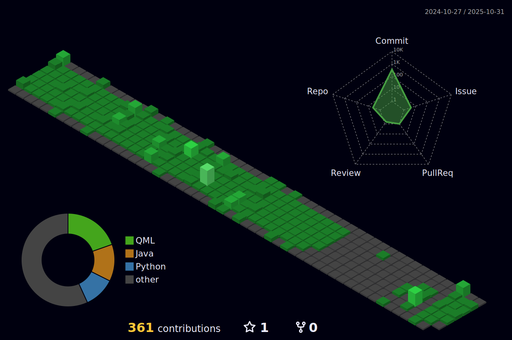

  

<h1 align="center">I'm Irrisorr (also George / Heorhi)</h1>
<h3 align="center">A student of Computer Science at Poznan University of Technology</h3>

👨‍💻 I'm into Java, Python app dev, and indie game design, with a focus on AI.

🌱 I’m currently learning **Spring, Node.js**

📫 How to reach me **zakharkevichg@gmail.com**

# Languages

English (B2) - Upper-Intermediate;

Polish (C1) - Advanced;

Russian - Native;

Belarusian - Native.

# My Skills

# Contacts

---

